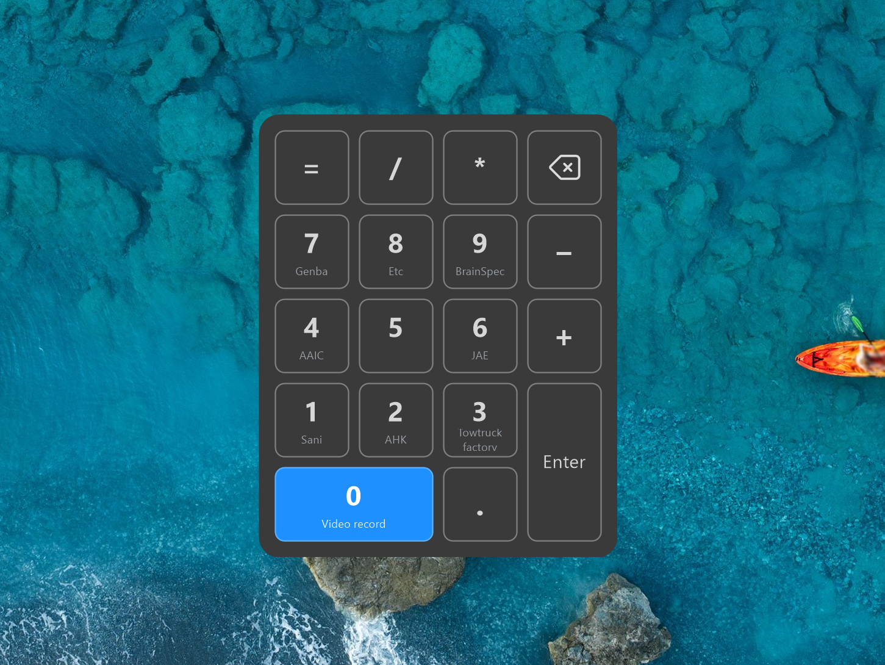

# Sygnal HotPad

A hotkey + numpad virtual-desktop manager for Windows 11. One tray app to switch desktops, move and pin windows, name desktops, and pop a numpad-style preview HUD — all from the keyboard. Built on [AutoHotkey v2](https://www.autohotkey.com/).

<p align="center">
  
  <br>
  <em>Hold <code>Ctrl+Win</code> for the preview keypad: desktops 1–10 laid out like a numpad, the current one highlighted, named desktops labelled, and operator keys showing their assigned launchers.</em> 
</p>

## Features

- **Switch desktops** by arrow or numpad, with wrap-around.
- **Move the active window** to another desktop — following it, or staying put.
- **Pin** an app or a single window to every desktop.
- **Launch apps & Chrome profiles** from the keypad's operator keys (`+ − * / = ( ) Enter`) — each assignment can carry a name that shows on the HUD.
- **Preview HUD** — hold `Ctrl+Win` for a numpad-style map of desktops 1–10, the current one highlighted, with names.
- **Name desktops** using the native Windows 11 desktop names (also shown in Task View).
- **Back** to the previous desktop, browser-style.
- **One Config dialog** (`Ctrl+Win+.` or the tray) — rename desktops, set keypad size, and edit launchers; saved per machine.

## Requirements & install

1. Install [AutoHotkey v2.0](https://www.autohotkey.com/).
2. Get this repo — `git clone https://github.com/sygnaltech/hotpad.git`, or use **Code → Download ZIP** and extract anywhere.

The VD.ahk virtual-desktop library is bundled in `lib/`, so there is nothing else to download.

## Running

Double-click **`hotpad.ahk`** — it loads the whole suite into a single tray icon ("Sygnal HotPad"). To launch it with Windows, put a shortcut to `hotpad.ahk` in your Startup folder (`Win+R` → `shell:startup`).

## Hotkeys

> Numpad hotkeys assume **NumLock is ON**. `Numpad0` = desktop 10.

### Navigate desktops
- `Ctrl + Win + ←/→` — previous / next desktop (wraps around)
- `Ctrl + Win + Numpad1…9` / `Numpad0` — jump straight to desktop 1–9 / 10
- `Ctrl + Win + Backspace` — back to the previous desktop you came from
- **Hold `Ctrl + Win`** — show the numpad preview HUD (release to dismiss)

### Move the active window
- `Ctrl + Alt + Win + ←/→` (or `Numpad0…9`) — move to that desktop and follow it (alias: `Ctrl + Win + Shift + ←/→`)
- `Alt + Win + ←/→` (or `Numpad0…9`) — move to that desktop, stay put

### Pin & config
- `Ctrl + Win + Z` / `X` — pin the active app / just the active window to every desktop
- `Ctrl + Win + .` (NumpadDot) — open the **Config** dialog (tabs: **Desktop** to rename the current desktop, **Settings** for keypad size, **Launchers** to assign keys). Also on the tray menu as **Settings** / **Launchers**.

### Launchers — apps & Chrome (configurable)
Assign the keypad's operator keys — `+ − * / = ( ) Enter`, each prefixed with `Ctrl + Win` — to launch things. Open the **Config → Launchers** tab and double-click a key:

- **Application** — pick (or paste) a program path, with optional arguments.
- **Chrome** — opens a **new window on the current desktop**; choose a specific profile, or *Ask each time* for a quick profile menu.
- Give the assignment a **name** and it shows under that key on the preview HUD.

Out of the box, `Ctrl + Win + /` opens the Chrome profile menu.

## Standalone extras

Not part of the suite; run the script directly if you want it:

- `extras/virtual-cascade.ahk` — cascade / tile the windows on a desktop (`Win+Alt+C/H/V`; add `Shift` to affect only same-app windows)
- `extras/app-specific-tab-switcher.ahk` — macOS-style ⌘-` cycling between windows of the same app (`` Alt+` `` / `` Alt+Shift+` ``)

## Repository layout

```
virtual-combined.ahk    the whole suite (one tray icon)
hotpad.ahk              entry point — run this; it loads virtual-combined
virtual-icon.*          tray icon
assets/                 keypad key icons + doc screenshots
lib/                    bundled VD.ahk dependency (see lib/UPSTREAM.md)
reference/              the individual scripts that were folded into the suite
extras/                 standalone scripts (cascade, app switcher)
legacy/                 older / niche scripts and notes
```

## Troubleshooting

- **Errors or nothing happens on launch:** make sure you installed AutoHotkey **v2** (not v1).

## Credits & third-party

- **VD.ahk** by Fu Pei Jiang ([@FuPeiJiang](https://github.com/FuPeiJiang)) — <https://github.com/FuPeiJiang/VD.ahk> — MIT. Bundled, unmodified, as [`lib/VD.ah2`](lib/VD.ah2); see [`lib/UPSTREAM.md`](lib/UPSTREAM.md) and [`lib/VD.ahk-LICENSE`](lib/VD.ahk-LICENSE).
- Originally forked from [**Win11AutoHotKeyFixes**](https://github.com/phazei/Win11AutoHotKeyFixes) by Adam Segal ([@phazei](https://github.com/phazei)) — MIT. Sygnal HotPad started from that project and has since diverged substantially — consolidated into a single suite, with the numpad keypad HUD, desktop naming, desktop back-stack, settings, and rebrand. Little of the original code remains, but it was the initial inspiration, and the original copyright is retained in [`LICENSE`](LICENSE).

## License

[MIT](LICENSE)
